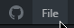
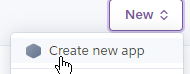
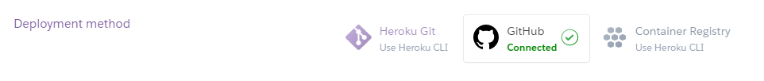
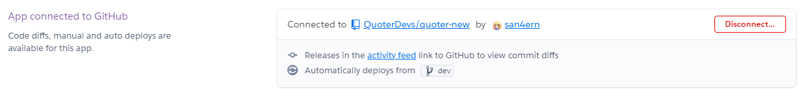
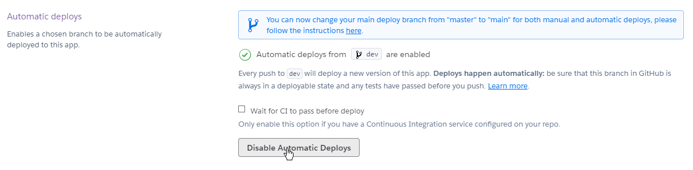
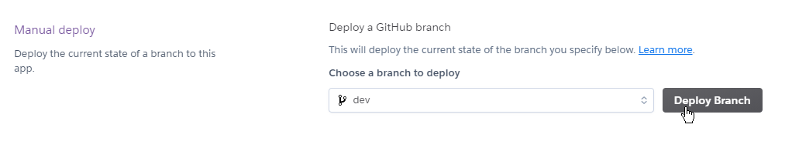
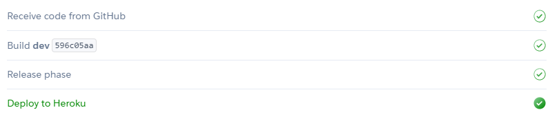
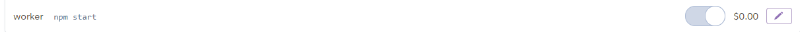
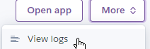
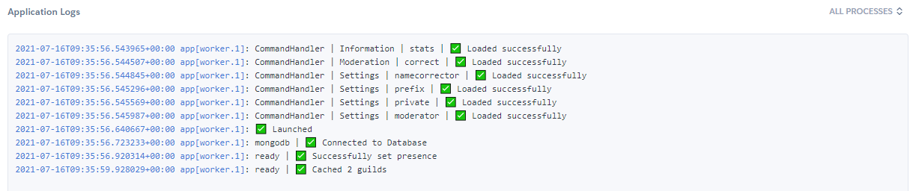

# Установка бота на хероку

### Пункт 1


В нашей директории бота необходимо создать файл с названием Procfile и написать там `app: node .` в случае, если наш бот написан на node.js. В противном случае - в зависимости от вашего языка программирования


> Заходим на  [https://heroku.com](https://heroku.com) и регистрируем аккаунт нажав кнопку справа вверху


После регистрации в аккаунте можно привязать карту, чтобы лимит часов в месяц был 1000, заместо 400


### Пункт 2

> Авторизуемся на [https://github.com](https://github.com) и потом скачиваем GitHub Desktop \([https://desktop.github.com](https://desktop.github.com)\)
>
> Авторизуемся в приложении и жмём эту кнопку

> Указываем своё название и путь к файлам и по желанию делаем публичным, либо закрытым
>
>   
> Далее делаем коммит и пушим наши файлы

### Пункт 3

> Возвращаемся на Heroku и справа вверху, ниже от аватара, жмём следующие кнопки

> Указываем название и регион


В случае дискорд-бота, желательно указывать регион Америка, чтобы задержка была ниже



Ниже мы наблюдаем эту кнопку, что-же она значит?



Данная кнопка создана для связки несколько приложений в один общий проект. В нашем случае, она особо не нужна


### Пункт 4

> Заходим в созданное нами приложение и жмём кнопку Deploy, выбираем метод публикации GitHub

> Ниже подключаем наш GitHub-аккаунт и выбираем репозиторий для публикации

> Ниже по желанию можно включить автоматическую публикацию, которая будет публиковать код при любом изменении в репозитории

> Спускаемся ниже и жмём кнопку

> У нас запускается публикация проекта и его сборка. Если результат позитивный, у нас будет примерно такой результат

### Пункт 5

> Идём во вкладку Resources и на нашем `app: node .` жмём карандаш и нажимаем ползунок \(в моём случае `worker: npm start`\)

> Справа жмём следующие кнопки и наблюдаем наши логи консоли \(если таковые являются\)

### Окончание


Если тебе помог и понравился данный гайд - оставляй оценку ниже. Так-же заглядывай сюда в случае новых гайдов. Удачи!


#### 

